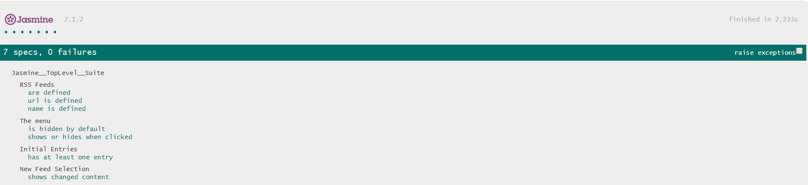
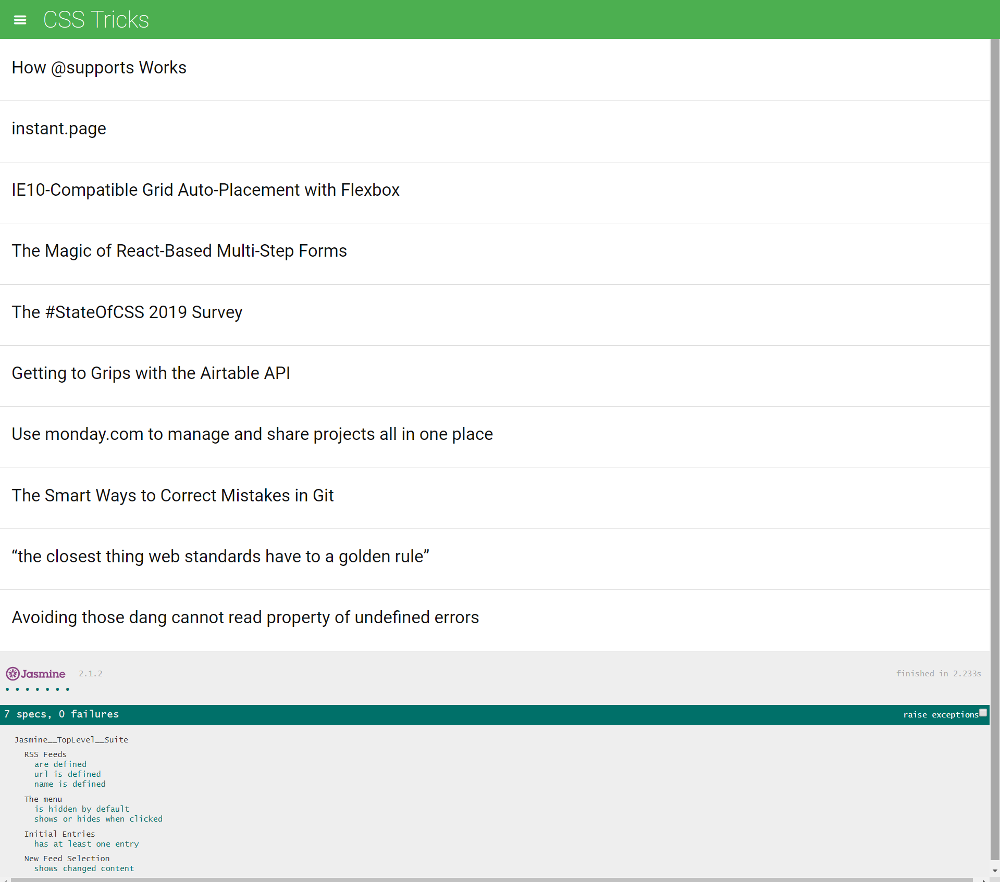

# Feed Reader Testing Project

## Table of Contents
* [About](#about)
* [About the Application](#about-the-application)
* [Application dependencies](#application-dependencies)
* [How to Run the Application](#how-to-run-the-application)
* [Resources](#resources)
* [Technologies](#technologies)
* [Application Functionalities](#application-functionalities)
* [Contributing](#contributing)

## About
Feedreader Testing creates a great opportunity for writing effective tests using Jasmine that requires analyzing multiple aspects of an application including the HTML, CSS and JavaScript.These will test the underlying business logic of the application as well as the event handling and DOM manipulation.

## About the Application

This is a web based RSS feed reader application. It uses the Google Feed Reader API to grab RSS feeds as JSON object we can make use of. It also uses the Handlebars templating library and jQuery.We use [Jasmine](https://jasmine.github.io/) to write test suites for unit testing.

## Application-dependencies

            This application Requires Active Internet Connection to Run

* Our RSS feed reader application uses **_Google Feed Reader API_** to access the Feed websites' content.
* **_Handlebars_** is used to build semantic _templates_, avaiable through jsDelivr CDN included in _index.html_
* **_jQuery_** is used which is avaiable through Google Hosted Libraries included in _index.html_
* **_Jasmine_** a JavaScript Testing Framework is used for our javascript _unit testing._
* Jasmine is included in the project assets. To explore, locate the jasmine/lib directory in the root directory.

## How to Run the Application

 1. Download the zip folder and unzip it.
 2. _Open_ the main folder and _locate_ the **index.html** file.
 3. _Open_ the **index.html** file in your preferred **_browser_** while connected to the **_internet_.**
 4. It may take some time to completely load as additional network requests are made. Once loaded, all the **test suites** can be seen at the _bottom_ of the web page under the name Jasmine.

## Application-Functionalities

#### Test suites implemented in the application to ensure:
###### 1. allFeeds array is defined and contains an feed object which are not empty.
* Test suite **RSS feeds**
* Spec
     * allFeed `array` is `defined`
     * allFeed array `length` is `not empty`

###### 2. Each feed object in the allFeeds array has its URL property defined and not empty.
* Test suite **RSS feeds**
* Spec
     * Feed `url`property is `defined`
     * Feed url `length` is `not empty`
###### 3. Each feed object in the allFeeds array has its name property defined and that the name is not empty
* Test suite **RSS feeds**
* Spec
     * Feed `name`property is `defined`
     * Feed name `length` is `not empty`
###### 4. The menu containing all feed list is hidden by default and toggles to show or hide when the menuIcon is clicked.
* Test suite **The menu**
* Spec
     * Menu is `hidden` by _default_
     * When menu icon is _clicked_ menu list _toggles_ to `show` or `hide`

###### 5. When loaded there is at least a single entry within the current feed container.
* Test suite **Initial Entries**
* Spec
     * When asynchronous `loadFeed()` is done loading feed
     * The feed should display at least a single **entry**

###### 6. When a new feed is loaded by the loadFeed() that the content is different.
* Test suite **New Feed Selection**
* Spec
     * When asynchronous `loadFeed()` is done loading two feeds
     * Make sure that each loaded feed content is different from each other.

## Resources

* [Jasmine](https://jasmine.github.io/)
* [Google Hosted Libraries](https://developers.google.com/speed/libraries/)
* [jQuery](https://jquery.com/)
* [jsDelivr CDN](https://www.jsdelivr.com/)
* [Handlebars](https://handlebarsjs.com/)
* [Udacity References](https://github.com/udacity/frontend-nanodegree-feedreader)

## Technologies

* Visual Studio Code Editor
* Jasmine Testing
* Javascript
* jQuery
* HTML
* CSS

## Contributing
Any suggestions are welcome.

##### How to get started
1. Explore the application to _locate_ its
   * HTML _(./index.html)_
   * CSS _(./css/style.css)_
   * JavaScript _(./js/app.js)_ to gain an understanding of how it works.
2. Explore the Jasmine spec file in _(./jasmine/spec/feedreader.js)_ to view the test suites.
   * Review the Jasmine documentation online.

* Here are some Resources to get started and Understand more about Jasmine testing if you are a Begineer  
[1] https://jasmine.github.io/1.3/introduction.html  
[2] https://www.tutorialspoint.com/jasminejs/jasminejs_overview.htm  
[3] https://codecraft.tv/courses/angular/unit-testing/jasmine-and-karma/  

